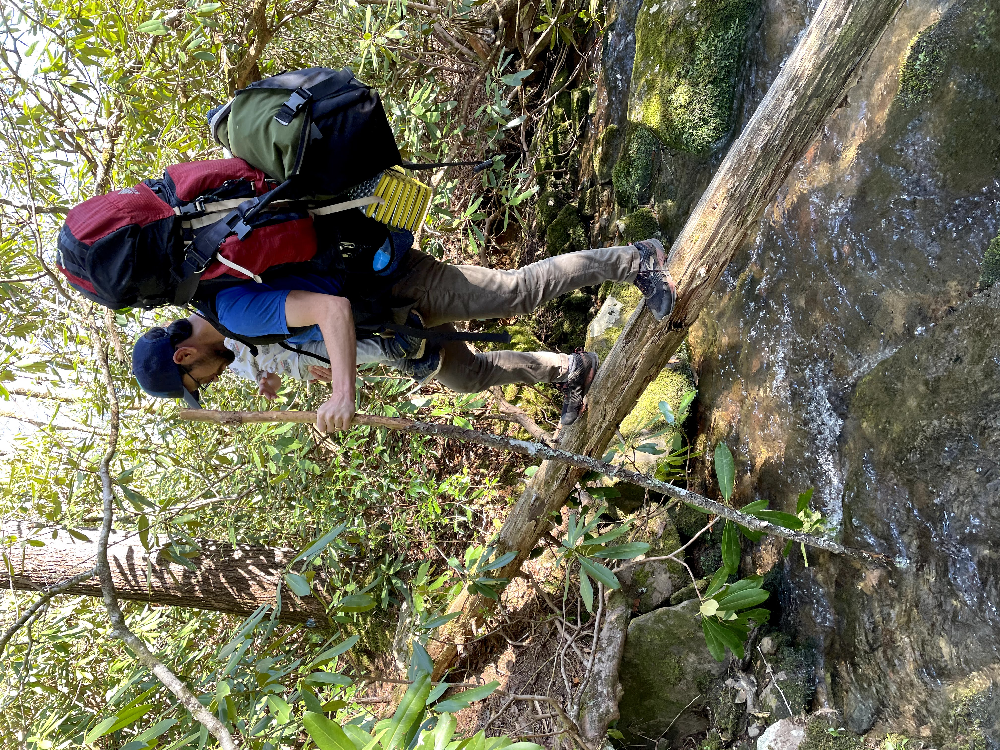

This spring has been challenging in many ways. The Jewish holiday of Passover was 
during a busy, challenging part of a busy, challenging spring. It was timely for me
in that my family connected and we had the chance to think a bit about things for 
which we are thankful (sorry, matzo is not one of them).

One part of the Passover dinner and service - the Sedar - is, for my family, singing
the song [Dayenu](https://en.wikipedia.org/wiki/Dayenu). Comically, the song (for my)
family mostly consists of singing the word dayenu, in different ways, over and over. The
(other) part is sung a bit fast, and it's kind of complex, and honestly almost a 
bit of a parody of difficult to sing (and speak) Hebrew.

Anyway, dayenu means "it would have been enough," and, in addition to singing the song, 
there is a part of the sedar that involves giving thanks for (historical) miracles. But 
more importantly, to me, it is a chance to express some gratitude. And I have a lot
about which to express gratitude. Curiously, last year around this time, pre-COVID,
[we were grateful[(https://joshuamrosenberg.com/posts/sickness-and-gratitude/)] because our son had a successful, minor (outpatient) ear tube surgery, after a challenging (for different reasons) spring. 

So, I am grateful for...

- My wife Katie, who is perfectly amazing 
- My little one, who is the same
- Where we live - I was able to go backpacking with my little one this past weekend in one
of the most unique and beautiful places in the world

- Our parents and my brother
- My friends and my colleagues
- My job

Dayenu. Each would have been enough.