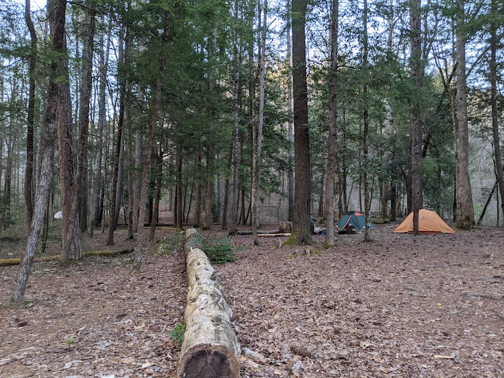
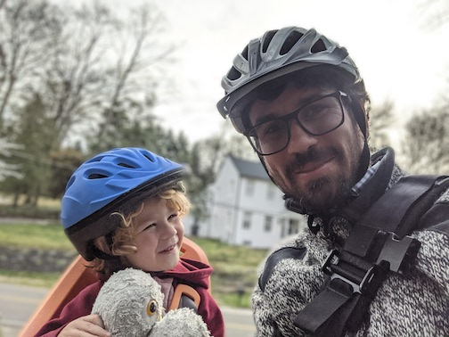

This isn't a new idea, but one thing I've thinking about parenting is that in some
ways it accentuates normal activities. A car ride isn't just a car ride; it's a rollicking
sing along or a chance to see a "BUS!" or "CHOO CHOO TRAIN!". A hike isn't just a two-mile walk;
it's an epic adventure, leading to trips and falls and adventures near/into the river. 
And, relaxing isn't relaxing. It's... something got on my shirt! Or my tushie itches. Or...

This week, though, has been one of the "ups" out of the "ups and downs" cycle. Both built on
things we've been trying/doing, but they came together in a way that makes me sort of feel like
... things are going okay with our parenting/as a parent.

One thing was backpacking with my son and a close friend and his son. We talked about
renting a hotel room or cabin in Gatlinburg, in part because it was so cold at night - around 32F
in the mountains at around 7am (even though it was around 65F during the day). But, we couldn't
find a notel - Easter weekend. So we discussed backpacking, and determined to try it. We (I)
waivered, and discussed car camping to have a bail out option, but decided we'd hike in
around one mile to backcountry site #1. When we got there, we were feeling okay - so we decided
to continue on to another site, around two miles further. It was hard and fun.

The second was biking. I used to bike to work - for three years when I was a graduate student 
at Michigan State, my wife and I shared a car, and I didn't have a parking pass. It was one
of the most important parts of my identity. I continued cycling at UTK, but not as much. Our son's
daycare was on the other side of town (roughly), and it wasn't very safe to bike there. But, then,
a spot opened at a daycare closer to campus, and though the bike ride isn't ideal in some ways, it 
works, and we've been trying biking. We biked every day this week for the first time; it's 
harder, in many ways, than driving, and gearing up to get ready is a bit of a slog, but... it was fun.

I don't have much to add - just a chance to plant a flag and say that everyday things - 
a busy conference week - can be augmented by parenting, in addition to and in the context
of all of the sick kiddos, weeks being up at night with no sleep, and not paying enough attention to
my little one while trying to work in the morning/evening...