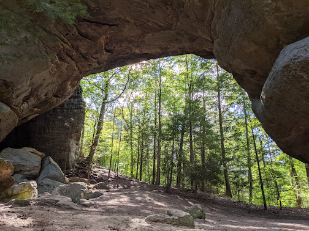

I taught at a high school (and went to college) in North Carolina and the drive from North Carolina to 
my family in Michigan usually took me through the highway that winds down from around Asheville, past Candler,
and through the heart of the outhern Appalachian mountains. The Appalachian Trail crosses the highway - I-40 -
and at different points along the drive one is between a few and five or so miles from the Smokies. The drive is 
often a bit wild; [rock slides very regularly close the highway, sometimes for weeks](https://www.knoxnews.com/picture-gallery/news/2019/07/17/historic-photos-interstate-40-biggest-rockslides/1656940001/). 

At the same time, when moving to Knoxville, I am not sure I could have said what or where the [Cumberland Plateau](https://en.wikipedia.org/wiki/Cumberland_Plateau) is. This sounds absolutely banal, but I believe the key
to initially understanding the area is that it's a plateau--and that makes it distinct from the mountains. Also, 
it's different from Michigan.

Here's a picture from this past weekend at [Big South Fork](https://www.nps.gov/biso/index.htm):

Ostensibly, one of the [Twin Arches](https://www.tn.gov/environment/program-areas/na-natural-areas/natural-areas-east-region/east-region-/na-na-twin-arches.html) is the largest ock arch in the Eastern United States and one of the largest in the world. I think being a part of the Cumberland Plateau - being close to the Southern Appalachian and Smoky moutains - they slip beneath peoples' radar. There seems to be a near-constant conservation effort, with more [land being purchased to be public](https://www.knoxnews.com/story/news/2021/09/23/tennessee-skinner-mountain-cumberland-plateau-now-protected/8417864002/). Taking the acreage of Big South Fork National (part of the National Park system; ~125,000) and the Cumberland Trail (~35,000), Fall Creek Falls (25,000), Frozen Head (~25,000), South Cumberland (~25,000), and Pickett (20,000) State Parks alone (there are other public lands), this area is around half of the size of the Smokies (~500,000 acres).

This is all to say, I have an interest in spending more time in this area and to try to understand it a bit better.