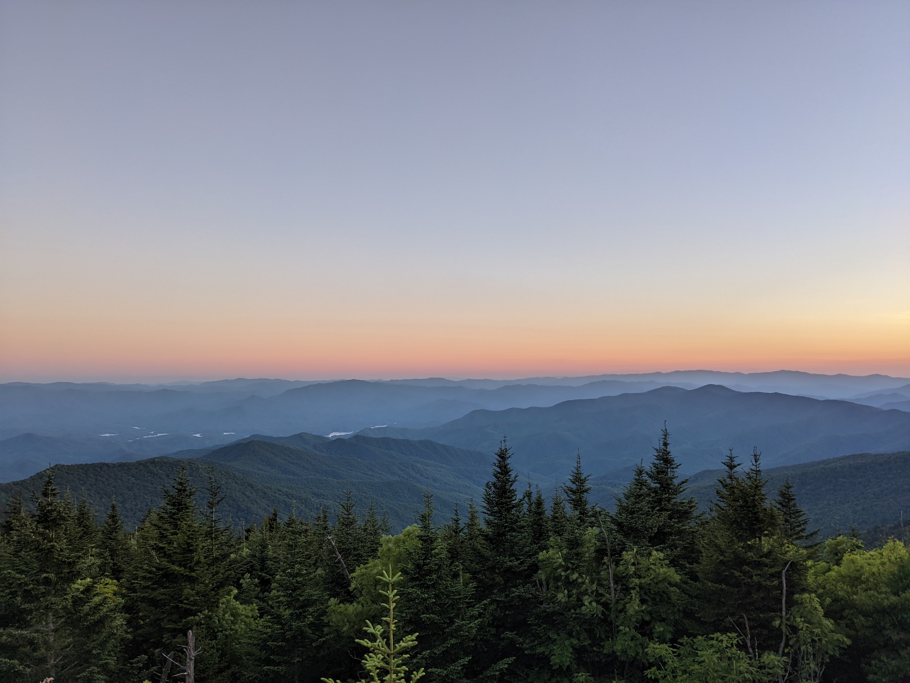

On a whim, we drove to the [Elkmont Campground](https://www.recreation.gov/camping/campgrounds/232487) in the Great Smoky Mountains National Park. Our intent was to see the [Synchronous Fireflies](https://www.nps.gov/grsm/learn/nature/fireflies.htm) that mate - alight and in synchronicity - from around the last week of May through the middle of June. On the drive there, we decided that it wasn't too far to drive to park at Clingman's Dome (the highest point in the Smokies and the second-highest point in the Eastern United States), but to head away from the short trail to Clingman's Dome itself, down the approximately 1.9 mile Forney Ridge Trail toward Andrews Bald, one of two grassy balds in the Smokies; summits surrounded by northern pine trees (spruce and fir) that are, [somewhat mysteriously](https://en.wikipedia.org/wiki/Appalachian_balds) grassy balds, themselves covered in grass and Azalea, Rhododendron, Mountain Laurel, and Blueberry.

We stopped at Newfound Gap and hiked along the Appalachian Trail for just a bit.

We then drove the seven miles from Newfound Gap to the parking nearby Clingman's Dome, setting out around 7 pm along the trail, chilly due to the breeze. Not far down the trail, a group was returning back to their car, and we asked them how their hike was and whether they made it to the bald. They had, but they saw two bears along the way. I was a bit taken aback; Katie, my wife, had asked if bears were common here in the car, and I had replied naively that they were unlikely to be here. These hikers had bear spray and whistles around their neck. What gives? I've hiked a lot in the Smokies over the past four years, staying overnight at backcountry sites in more remote locations than Andrews Bald twice already this year, with no trace of bears seen. I've only seen one bear outside of Cade's Cove (where they're hard to miss); I was alone and it was in a super remote location with no one in site (on Bradley Fork off the Appalachian Trail, far from any landmark or major trail). The bear darted away soon after seeing me; it was a cool experience that caused my heart to beat faster, but it was anything but scary after the bear and I see the other.

We hiked on, me nervously laughing and Katie giving me nervous, comical glances that avoided our son's gaze. 

We soon passed a pile of bear scat, and then a few more hikers who reported seeing a bear at Andrews Bald. We passed more bear scat and then a third group who mentioned seeing two bears, one at the bald and one on the return hike. We continued, excited but a little nervous, entering a darker part of the trail---covered in dense spruce-fir. We hiked along timber that was used to keep this part of the trail from eroding due to the amount of rail that falls at this elevation. 

We hiked on, approaching the intersection of the Forney Ridge and Forney Creek trails in advance of brief ascent up to Andrews Bald when we saw a bear ambling down the path. It looked and us, but unlike the bear I saw earlier, this bear did not dart away, more scared of us than we were of it. 

Instead, it turned toward and walked toward us. Katie said I turned around and that I did not need to say any words. Katie scooped Jonah up and we turned around and started to walk the other way, Katie saying "Let's go, let's go, let's go" and asking me, around ten yards behind, to keep speaking so she knew where I was as she high tailed it away. I stopped to see whether the bear had done the same, thinking that it surely had become startled or distracted, but it was neither, heading toward us in a lackadaisical but unhalting way. I asked Katie to make sure our son saw the bear---what an experience! She did, and then promptly high tailed it up the trail. 

We kept going, singing songs and speaking loudly to discourage the bear, joking that this - slightly uphill to the Clingman's Dome parking lot - was a great way to get into shape. After around ten minutes of this, we stopped, sitting down to grab a snack and water as the sun was beginning to set. We did this for around a minute when my son accidentally knocked half of my fruit bar from my hand. I picked it up and looked down the trail we had just hiked, where I saw the same bear about fifteen yards away, curiously, lackadaisically, consistently walking toward us. It wasn't small. Knowing that people consistently overestimate the size of bears, I'd estimate that it was around 175 pounds; probably not a yearling. Where earlier our reactions went from surprise at the bear's lack of fear of us to a slight urgency to get away from it, our reaction at this point approached one that was more urgent: We picked up our bags in our hands and more or less ran up the trail. I was tempted to toss the bear the half-eaten, dirt-covered fruit bar in my hand, but resisted. We had about one-third of a mile to go to the car, and we made it there singing and shouting, huffing and puffing. Maybe I should have yelled at the bear louder or thrown sticks or rocks at it. I didn't, but we made it back just as the sun set.

We got to the car and relaxed a bit. It was a bit of an unexpected adventure, but we still wanted to get back to the fireflies in Elkmont. We did, fell asleep late, and went to the ranger's station the next morning, where they asked us to file a report, describing the bear's behavior as unusual and concerning. It was not, I think, ever very dangerous; the bear almost certainly wanted us to toss it some food. On such (strictly forbidden) occasions bears are fed (or given in a panic) food, unexpected encounters can occur; the bear can accidentally or even intentionally brush against a person. These kinds of interactions are bad because then the bear almost certainly will be euthanized by rangers later. I am glad that we avoided any further contact and humbled by the event; I figured every bear I saw would be more scared than me! Humility and bear spray will encounter me on similar high-country hikes going ahead.
