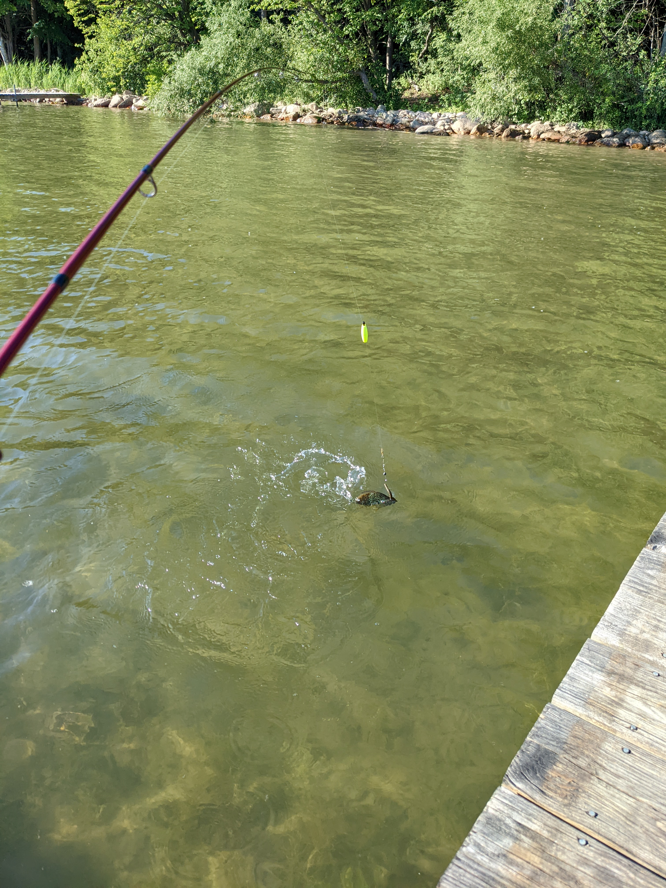
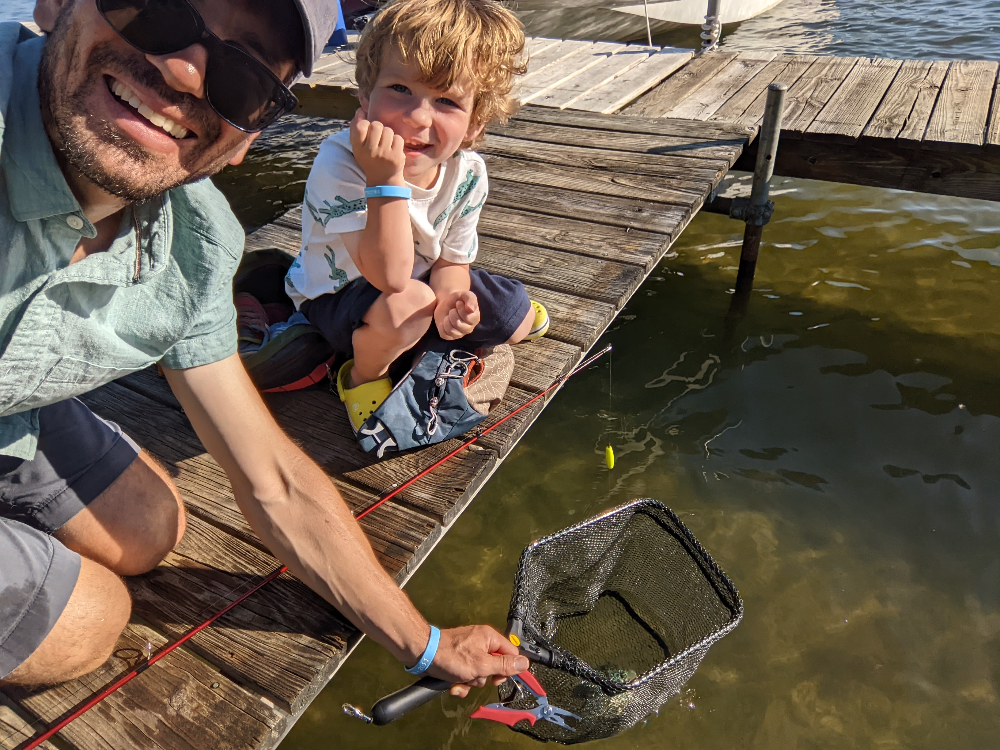

Around two years ago, my family and I saw someone fishing in the Tennessee River at the park and playground near our house. My son was interested, and though I am far from the most engaged parent indoors, I am happy to try to follow his outdoor interests where they lead. I was also interested in fishing.

My Dad had purchased a Ronco Pocket Fisherman a few years back, thinking we could use it while camping or even backpacking. It worked pretty well!

We used this on at least two occasions, the rod and reel already spun with the line, using one of the included lures. We didn’t catch anything, but we had fun.

On a rainy winter day this year, we were at Dick’s Sporting Goods, and I was happy to see they had a great fishing section, so I talked with an employee who knew a lot about fishing and settled on an inexpensive rod and reel that would be much easier to use than the slightly comical Pocket Fisherman. I also picked up some line, strung it at home, and rigged up a hook and artificial worms I’d purchased.

We fished with this setup on three occasions, twice in the Smokies (near the Townsend Wye). No fish, though.

During a stop at Wal-Mart, I saw a Paw Patrol kids rod and reel, already strung, with a cute (though not usable for fishing) fish attached to the end. The rod and reel, though, could be rigged with a hook, which I did, and we fished once more, this time following a family bike trip to the University of Tennessee Gardens and a popular spot for fishing along the Tennessee River just past the gardens on the greenway. There, we saw two other people fishing, two Dads with their (older) children. One of the two invited us to grab a few of the worms they had brought; I did and we had fun, but no luck. No fish.

We came to Michigan, and I brought both our rods and reels to fish. Yesterday, Katie went with our son to a beach and reported back that our son saw someone catch a fish. I was happy; I learned that the person he saw caught a fish using an innovative method: crumbling tortilla chips into the water and then swinging a net into the water to catch one or more! He then put the fish into a bucket he had brought. I admit I was a bit jealous that our son saw someone else catching a fish. We had tried so many times! How old was this skilled person, I asked? He was seven. I was (mostly jokingly) upset! How could this seven-year-old beat me to catch a fish with our little one? Also, does using a net in that way really count?

Last night, we set off for the beach, rod (and a net) in tow. We hung out in the water, downed a Clif Bar and some tortilla chips we’d brought, and walked over to the spot where we thought there might be fish. I texted my brother a picture: we’re going fishing! I had rigged the rod with an artificial worm and a bobber at home, casting out once we walked onto the dock and reeling the line in. My son noticed the dock was too high to use the net in the way he had observed the successful seven-year-old earlier in the day, so he asked if he could cast the line out. We did it together, and I handed the rod to him, and he began to reel it in.

A few moments later, he said the line was stuck. The first few times we fished, we didn’t use a bobber, and the hook and lure often got stuck on plants at the bottom of the river; he thought the same happened here at the lake. I looked over and saw the line moving around furiously. It was a fish! He reeled it in a bit more, and I caught a picture of the fish on the line.

We used the net to scoop the fish up. We next were challenged to remove the hook. This took some time. I had been manually removing the barbs on hooks to make this step easier (and to harm the fish less), but I forgot to for this one - I think from thinking that the odds that we’d catch one based on our prior experience was low!

We eventually got the hook out, tossed the fish (we think a Blue Gill) back in the net for a quick photo, and then together tossed the fish back in, where it energetically swam away.

