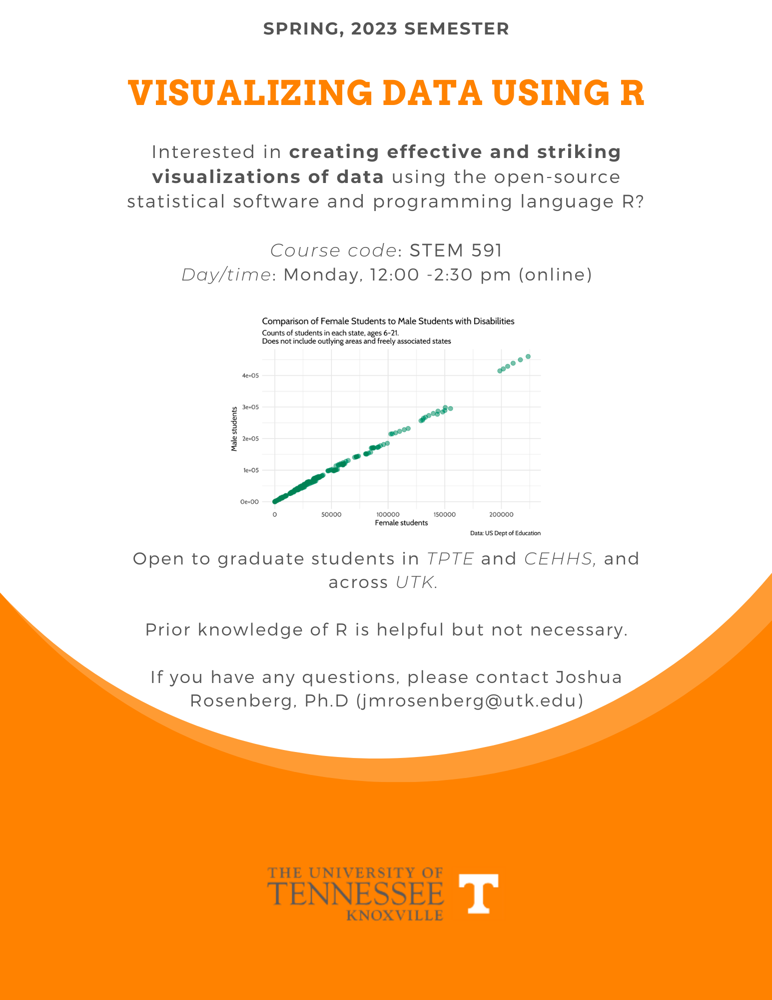

I'm offering a graduate-level course in data visualization to be offered for the first time this spring, STEM 591: Visualizing Data Using R. The course will be offered on Mondays from 12:00 – 2:30 pm. The modality will be online and synchronous. Please see the flyer below for several additional details.

This course is part of the [Educational Data Science Graduate Certificate program](https://volsonline.utk.edu/programs-degrees/educational-data-science-gc/), consisting of four courses that current graduate students and individuals interested in completing a stand-alone program complete. This is now the third course to be offered as part of the certificate and I think the instructional design, focus, and class culture are starting to get dialed in. Please consider sharing with anyone who might be interested.