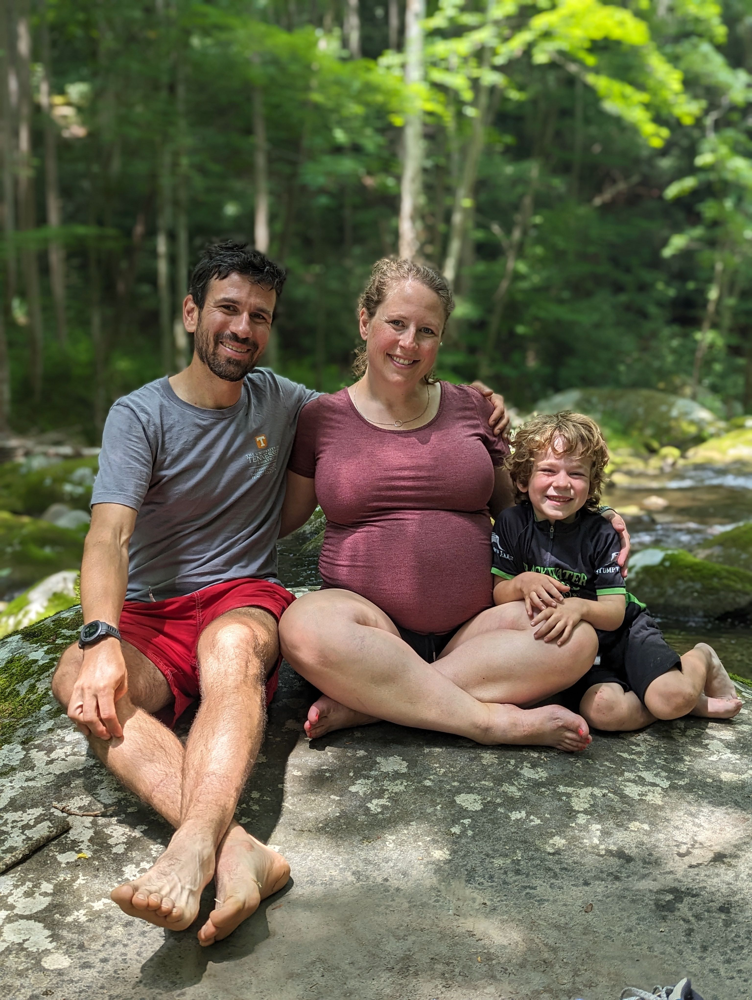

The last few weeks have felt like summer camp, with work, but a lot of time not at 
work, too: visiting family and friends. I keep intending to blog random thoughts, but haven't been motivated enough too---until now. Here goes!

### Biking and soccer

Our son has been super into biking and soccer, to the point that I am struggling to keep up with his energy - two-three or more bike rides per day, interspersed with soccer games (and some basketball). I sense that he may be like me---in need of a lot of movement, restless and even anxious without physical activity. It has been fun to see him focus athletically and to develop deeper interests in these hobbies/sports. 

### OneKnox

We went to a OneKnox soccer game last night that was a blast --- a 2-0 win to put them near the top of the USL League 1 standings.

### Work

Visiting Amsterdam and Dublin was good; productive and a trip that provided some new research ideas and some ideas for how I go about my research. My summer routine has been different than past summers, with few(er) deadlines, and more time to catch up, plan for the fall and the upcoming year, and to pursue ideas I do not have as much time to during the year.

### Pregnancy

Baby's due date is fewer than ten weeks away, and I am thankful to my colleagues to look forward to some protected time. My plan is to be completely away for eight weeks, then to gradually phase responsibilities back over the four weeks after that time - then, to be back. More importantly, I am sincerely excited (but a bit nervous) for baby. Katie and our son are excited!

### Driving to Michigan, driving to Knoxville

Being in Michigan brings lots of memories, and some nostalgia. It was great to be with my parents. Driving home to Knoxville felt good; within two minutes of arriving, our son had buddies over to paly with; around four neighbors said "welcome back". It felt good.

### Hiking

We are still hiking (and still working on the [Little Kids, Big Adventures](https://littlekidsbigadventures.com/seven-islands-loop-trail.html), trying to finish the book this summer before baby's due date). Here is a picture from a hike with good friends on a trail in the book, Middle Prong in the Smokies.

