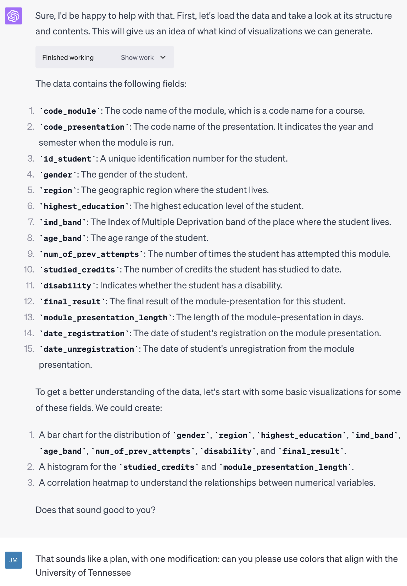

**tl;dr**: What chatGPT did for text, the Code Interpreter add-on does for data analysis.

Everyone has heard something about [chatGPT](https://openai.com/blog/chatgpt), but there is a beta feature that is less well-known, Code Interpreter. It is not free -- it is a beta feature enabled for anyone who pays for [chatGPT Plus](https://openai.com/blog/chatgpt-plus). It's sort of hard to find information on it, though the NY Times has [an article on it](https://www.nytimes.com/2023/07/11/technology/what-to-know-chatgpt-code-interpreter.html). Here is another article with [some instructions on how to enable and use it](https://www.pluralsight.com/resources/blog/data/chatgpt-code-interpreter-plugin-guide) (if you have access to chatGPT Plus).

In short, it lets you upload data and then do natural language data analyses with that data. For example, you can upload a data set (of seemingly arbitrarily large size, but I am sure there is some limit to the size of the data) and then literally just type: "Please create a few aesthetically-pleasing package to help me to get a handle on what this data's about and what patterns might exist in it."

I'll upload a 30,000 row data set, the [Open University Learning Analytics Dataset (OULAD)](https://analyse.kmi.open.ac.uk/open_dataset), and ask it just that.

It responded, and I responded with one additional request.

Here's a small portion of the putput --- visualizations and interpretations of them, as well as the option to ask for it to "Show work," which returns the python code that generated the plots.

Here is a link to all of the output, including for a logistic regression model: https://chat.openai.com/share/02820dd7-fb7b-4db0-90f9-3d3c11f571c4

In short, it can run code based on ... whatever you ask! It seems to be able to deal with arbitrarily large data sets and arbitrarily complex analyses; and different types of analyses (text and network analysis). 

I think many of us are a bit burnt out on hype about chatGPT and AI. Keeping that in mind, I find this pretty cool as someone who has done and taught data analysis for some time.

