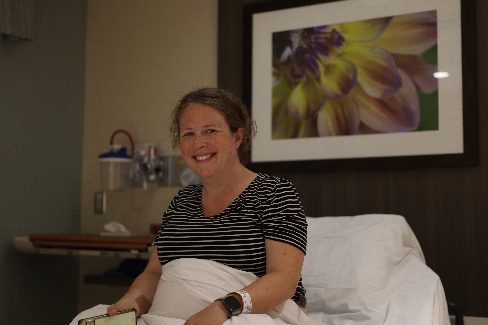
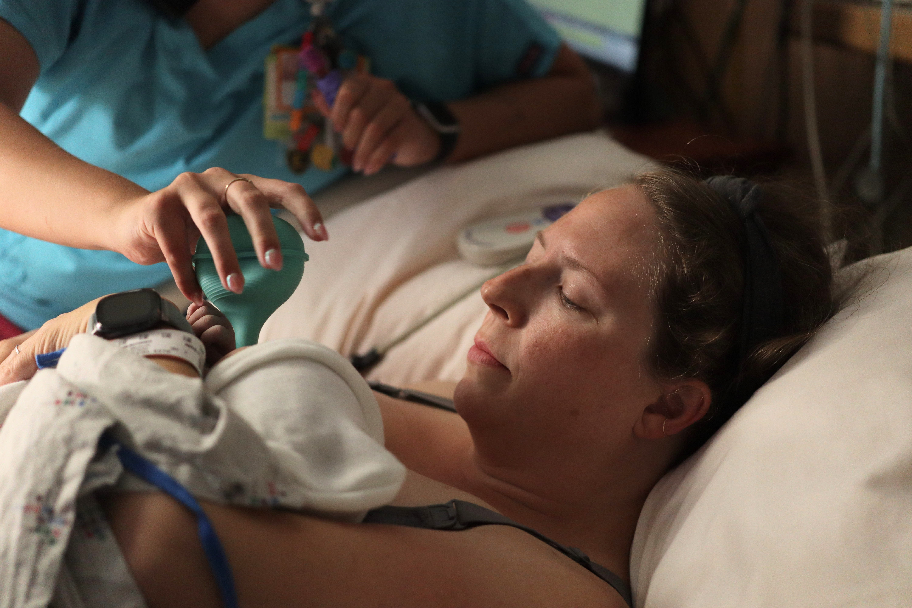
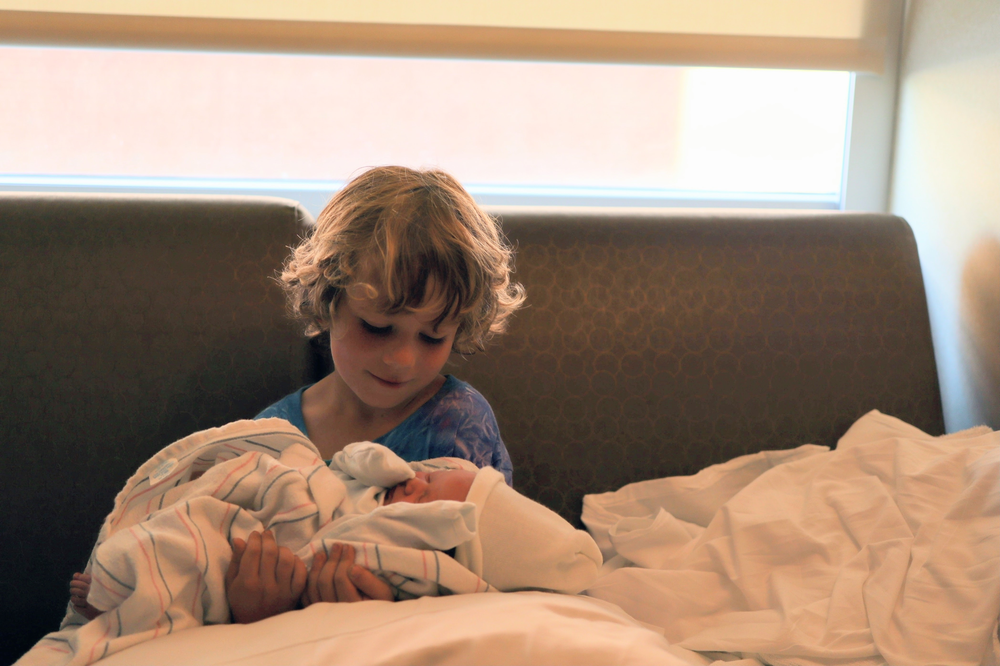

I'm going to share about the first few days with baby. Women (rightfully so) often share birth stories. Men don't often because it's not clear what men's roles when it comes to labor and delivery are or because such experiences aren't considered inately important. It can be really important for men to be good support people for their spouses and experiencing a birth can be among the important moment of one's life. So, I am sharing.

---

Three weeks ago, Katie began to experience signs of true labor, and we braced for the coming days by cleaning at home, calling and messaging friends and family, and getting bags ready for the hospital. We went to lunch around noon after I ran and Katie somewhat maniacally cleaned and then drove to the mall to walk; it was one of the hottest days of the year, if not the very hottest, with the temperature accounting for the head index exceeding 100F.

After walking a mile at the mall, Katie's experience of labor intensified; around a mile in, a woman looked at Katie and spontaneously remarked, "You look like you're about to pop!" I began using a contraction timing app on my phone. Oddly and unexpectedly, immediately after, a kid reached out to touch Katie's belly: For several reasons, it was time to leave the mall, excited and a little anxious. 

We headed home and Katie bounced on an exercise ball and watched the Golden Girls; I worked to arrange plans for our son for the afternoon and evening. Around three pm, Katie sounded alarmed, remarking that she had not felt the baby move in awhile. How long? A while, Katie remarked. A flood of anxious thoughts came over me. She called her doctor, who told her to head to the hospital. Katie felt the baby move, but I was now more anxious than excited. I picked up our son from school; our friends picked up our son from our house; and we anxiously headed to the hospital.

We arrived at the hospital and I dropped off Katie at the entrance to park. Katie asked whether I should bring our bags in or leave them in the car. On the way to park the car, I thought it would be best to bring them in, as I thought we were in it for the long haul. We arrived at the triage unit of the labor and delivery floor and within a few minutes we were in our room, our bags sitting along the back wall. Katie was hooked up to a fetal heartbeat monitor and the fetal heartbeat was fine; great. Next, a nurse practitioner checked her dilation to gauge how far her labor had progressed, sharing that she was at 3 cm. dilated, recommending that after a fetal non-stress test we walk around the hospital for an hour. 

Not discouraged, but bordering on so, Katie and I left our bags and began a trek around the hospital. It was still hot and though I tried to walk through some outside garden, Katie castigated me. By the end of the hour, Katie was having a hard time walking; at least one person during this time asked her if she needed a wheelchair. We were confident she had made enough progress --- enough to be formally admitted, at least. 

The nurse practitioner checked Katie's dilation again, promptly sharing that she remained at 3 cm. Katie was crushed. With our son, Katie's labor and delivery had been extremely protracted and challenging: more than 40 hours in total. I knew Katie was thinking about the prospect of enough lengthy, difficult labor. The nurse practitioner offered several options, including returning home and taking an opiate painkiller. She also offered that we could walk around the hospital again, though we would need to bring our bags with us as the triage unit had begun to get busy. Katie remarked that she was hard to please; none of the options sounded good. We decided to walk around the hospital once more as I texted a friend about the benefits and drawbacks of opiates.

With our tails between our legs, we left the triage unit and began walking around the hospital again, but it was really hard. It seemed like we could only walk for a minute or two until another contraction began. When they began, Katie had to lean on me or a wall. At least two people asked whether she needed a wheelchair; we explained, saying that she was asked to walk around the hospital to try to help labor to progress further. There was no walking out into the outside gardens. 

Eventually, we made it to some chairs near the hospital entrance, and got into a bit of a rhythm, where I'd put my hands on Katie's back when she had a contraction. I eventually got hungry, not having eaten since lunch amid the anxiety and excitement; could I get something from the Starbucks refrigerator case, I asked? The absurdity of this time is even clearer now. With about a minute to spare, I got some cheese and crackers. I started using the contraction timing app again. After we timed several contractions, it seemed to mock us: *It's time to go to the hospital!*, it pronounced. Katie could hardly talk, even in between contractions.

It had only been about 30 minutes, but we headed back to the triage unit. Back already? Yep. The room we originally had was still open, and so we returned, bringing out bags in once again. Katie was checked by a different nurse practitioner as there has been a shift change around six pm: You're at 4 cm., maybe 5 cm., she pronounced. I'm going to write it down as 4.5 cm., she said. You're staying here tonight. Katie was all relief. I snapped a picture after a few minutes, one that serves as a stark contrast to the previous hours. Katie said, "I did it."

A few minutes later, a nurse intern (this was a teaching hospital) _tried_ to start an IV line, but failed after a few jabs. Oops! The attending physician stopped by to check on Katie and then another nurse wheeled her to a room in a different unit; I picked up and brought our bags, ready to stop hauling them around. The next few hours are a bit fuzzy in my mind. Katie's contractions intensified pretty quickly. Another nurse inserted an IV line. She asked for an epidural, and a resident anesthesiologist came in soon after to explain the process. Katie's laboring was intense. The resident was slow and deliberate, asking what seemed like 100 or more questions about her medical history. Near the end ("Have you ever had a bent toenail?", we joked after), the resident was paged: Another patient may need an emergency C-section, and he would need to leave to check. I remember he said he'd try to return in 15 minutes or to find someone else to do the epidural procedure. 

This next stage was even more intense, the most of the entire labor and delivery. Eventually, at what seemed like the last possible moment, an anesthesiologist supervising the resident came in and---with few questions---promptly did the epidural. 

Katie immediately relaxed; I caught up with family via text and relaxed. I read on my Kindle and debated getting a cup of coffee. We both snoozed a bit.

Around ten or eleven pm, Katie's nurse mentioned that she was progressing well and that delivery could come anytime. Katie asked if she could relax a bit more---and she did. An hour or so later, labor picked up, and I tried my best to support Katie, holding her legs sturdily as I recalled not doing so firmly enough when our son was born. In the funniest moment of the night, Katie asked me to fan her face and head with a folder of papers; I tried, but didn't seem to actually move any air. Do it this way! I tried again. Katie yelled at me. The nurse took the papers and easily fanned her. Katie remarked after that I was an amazing support person . . . except when it came to fanning.

After maybe 15 or 20 minutes of pushing, Katie tried something else, not having me or the nurses hold her legs but instead pushing on her own. The nurses stepped back, trusting Katie to know what to do and how to do it, it seemed; I did, too. Because labor had been so lengthy with our son, I imagined Katie thought we were in for hours of this, and so when the nurses commented that she was close and was doing great, she seemed relieved and energized. I remember stepping back from the bedside and chugging around half of my water bottle. I had a feeling that we were really close.

Around five minutes later, Katie did it: baby arrived. There was a pregnant pause, giving meaning to the phrase. When my son was born, it felt like the most intense moment --- a few seconds --- of my life. Then he cried, and I burst into tears. This time, I felt ready. Before I knew it, baby Ayla cried loudly. There's something about that sound after hours, months, and even sometimes years of waiting. Baby Ayla looked, at first, like a little green alien. Whereas for our son I was startled---should he be so green? and covered in ooze?---I was ready this time. The nurses wiped her down and handed her to Katie. I cried a little, but didn't ball like when our son was born. The mood in the room was calm and happy. The attending physician calmly helped Katie; another nurse checked out the baby while another two assisted the physician (and Katie). A nurse mentioned she liked the music we had played; I joked about how Katie quickly vetoed the Bob Seger I briefly played, before reverting to [Tracy Chattaway](https://www.youtube.com/watch?v=k6H5X-cfecY). I was asked to cut the umbilical cord and did, not halting like I did with our son. While our son's labor and delivery had been protracted, our daughter's had been quick---so much so that the nurses suctioned her mouth and nose to suction out additional fluid.

Katie was wheeled to the "Mother Baby" unit and, again, I carried our bags down. It was around 4 am and a very cheery nurse explained all of the features of the room to us, down to the TV channels we could view; Katie, especially, was exhausted, and I was ready to conk out on the couch---not having had any coffee! The next morning we called and texted friends and family; I proudly changed baby's first diaper. family visited and baby brother met baby sister. These were sweet moments: Parents holding baby, son holding baby, and then Katie walking out of the hospital to head home with baby.

---

Over the first few days, my impressions of baby were centered on her knowing what she wanted and knowing what to do. I don't like the talk of "easy" or "hard" babies; it's over-simplifying, even if helpful as a kind of short-hand. As I helped baby try to calm down and fall asleep, I thought about hikes up LeConte. With wipes of baby's tush, I imagined future camping trips with my family. She was beautiful and strong.
 
A few weeks ago, I wrote about how camping with my son made me feel ["like it was on"](https://joshuamrosenberg.com/post/2023/07/30/pushing-farther-taking-shelter-more-parenting-thoughts/), like I could trust myself and trust him to do things together. It felt like he and I could do anything. Challenges lie ahead. Yet, Katie's confidence on the day that baby was born and the days after has been infectious, and I feel like with baby Ayla that "it's on"!?! 

And so it is, thankfully. We have had a stomach bug sweep through our family this week; inevitable, even endless challenges lie ahead. But I am thankful for the past few days (and weeks), for beautiful, strong baby, and for her beautiful, strong Mom.