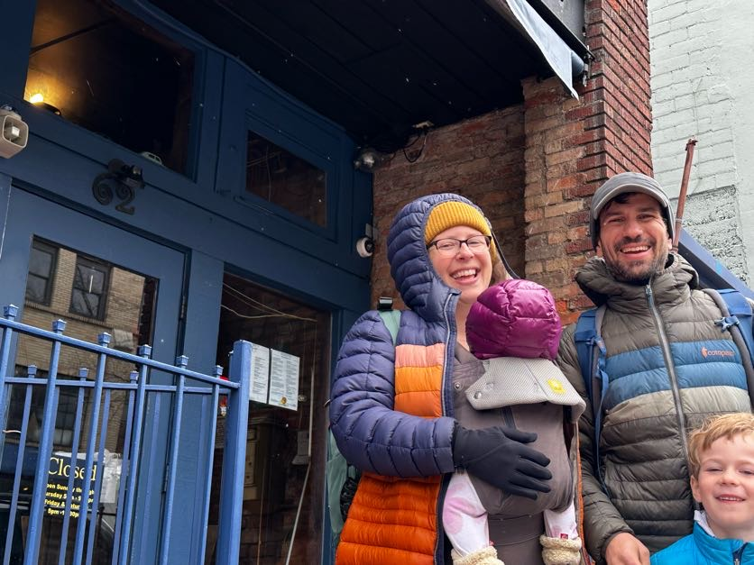

One of my favorite days of the new year is the winter solstice, a day filled with hopes and wishes for brighter days ahead

---

Our family traveled to Asheville to meet friends for a two-night trip, returning just last night. 

Asheville is where Katie and I had lived and met---at a Halloween party around 2009, less than a mile from where we stayed in our AirBnb. I was student teaching biology and chemistry at a high school in Swannanoa, just outside of the city, and Katie was running an after school program at a YWCA in the city. I ran by the house---Katie's rental, where we met. It had a baby swing out front.

In 2012, after traveling between Asheville and Shelby, where Katie continued working and where I worked, we had a bottle of wine and French bread at Bouchón, and I asked Katie if she would marry me.

We walked by Bouchón just yesterday---after our son unexpectedly threw up, but before he did again, causing us to cut our trip short. This particular picture our friend took is off-center and not really in focus, but I think it's somehow perfect.

When we got back to our AirBnb and realized our son wasn't well, we packed up, trying to get Zophran before the trip down the mountain. Katie was right---we needed it, though we weren't able to get some in time. The drive home was mostly chaos---throw up and baby tears---but as we made it out of the mountains my son rested his head on my shoulder, and I rested my hand on baby's arm, and it was quiet.

Today was cold, and we wanted our son to recover, so we kept interactions with friends to those outside. I snapped this picture of Katie with baby, looking happy despite the sickness and the cold.

---

I have hopes, wishes, and prayers for brighter days ahead, but the trick that the winter solstice and dark days can play is that they fill themselves with little moments of brightness---somehow concentrated by the dreariness. Off-center and blurry, but bright, and usually just enough to make it through the cold and into the new year.