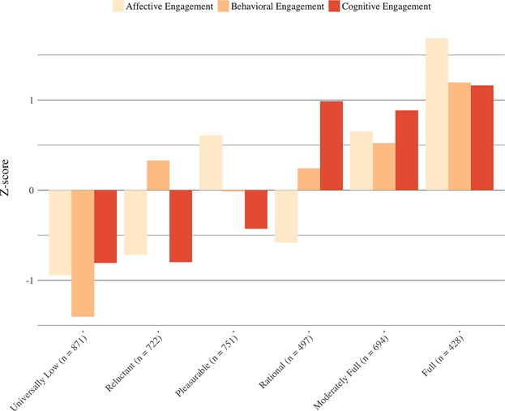
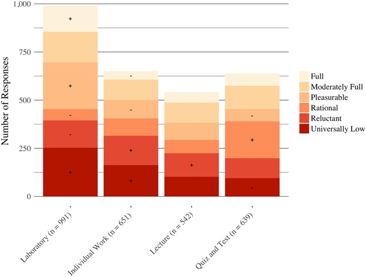

```{r setup, include=FALSE}
options(htmltools.dir.version = FALSE)
```

# Engagement in science

**Goal of this presentation**: Share findings from use of ESM to study engagement in science ([Schmidt, Rosenberg, & Beymer, 2018, *JRST*](https://joshuamrosenberg.com/pre-prints/Schmidt_Rosenberg_Beymer_2018_preprint.pdf)

- Has *multiple dimensions* and is *dynamic* (Sinatra, Heddy, & Lombardi, 2015, *EP*)

- Thought of in terms of three dimensions:

  - Behavioral engagement 
  - Cognitive engagement 
  - Affective engagement
  
- Experience Sampling Method

  - Can be used to study engagement
  - Assess in-the-moment experiences
  
---

# Profiles of engagement



---

# The type of activity



---

# The effects of choice

Choosing:
  - the *framing* (defining the problem, doing this particular activity, and the topic) and how to do the activity are associated with *full* engagement
  - the *materials* is associated with *moderately full* engagement
  - *with whom to work* is associated with *universally low* engagement
  - *how much time to take is associated with *rational* engagement
  
When students report being able to make *any* choice during laboratory:
  - they are more likely to report full engagement
  - this is not the case with the other learning activities examined
  
---

# Some findings from other research

- Though choice to enroll was a significant predictor of momentary engagement, positive affective experiences during the program may compensate for any decrements to engagement associated with lack of choice [(Beymer, Rosenberg, Schmidt, & Naftzger, 2018; pre-print)](https://joshuamrosenberg.com/pre-prints/Beymer-Rosenberg-Schmidt-2018-JYA.pdf)
- Creating/collecting data and modeling data seem to be associated with higher engagement [(Rosenberg, 2018; dissertation)](https://joshuamrosenberg.com/publications/Rosenberg-2018-Dissertation.pdf)
- Being more engaged is associated with changes in interest [(Rosenberg, Beymer, & Schmidt, 2018; pre-print, code, and presentation)](https://osf.io/s52vy/)

---

# Three takeaways

1. Engagement has multiple dimensions and is dynamic; ESM can be useful
1. Being able to make specific choices matters in terms of engagement
1. Laboratory activities can be more or less engaging, but being able to make any choice matters

---

# Contact & acknowledgments

Joshua Rosenberg  
[jmrosenberg@utk.edu](mailto:jmrosenberg@utk.edu)  
[http://joshuamrosenberg.com/](http://joshuamrosenberg.com/)  

Thank you to Jennifer Schmidt, Patrick Beymer, and colleagues   
Thank you to participating students and teachers!  
Thank you to the NSF (DRL-1421198 & DRL-1661064)  

*Any opinions, findings, conclusions, or recommendations expressed in this material are those of the authors and do not reflect the views of the National Science Foundation.*  